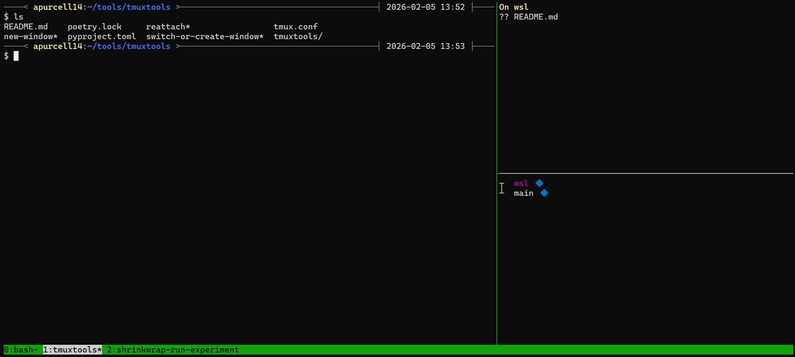

# tmuxtools

A collection of tmux configuration and automation tools for efficient terminal workspace management.

## Getting Started

```bash
git clone https://github.com/apurcell14/tmuxtools.git ~/tools/tmuxtools
ln -s ~/tools/tmuxtools/tmux.conf ~/.tmux.conf
uv tool install ~/tools/tmuxtools
# For working with git repositories
uv tool install git+https://github.com/alicederyn/git-sync.git
uv tool install git+https://github.com/alicederyn/gittools.git
# Reload your tmux configuration:
tmux source-file ~/.tmux.conf
```

## Features

### Key Bindings

| Key Binding | Action |
|-------------|--------|
| `C-a` | Prefix key (replaces default `C-b`) |
| `C-a a` | Send prefix through (for nested tmux sessions) |
| `C-a "` | Split vertically |
| `C-a \|` | Split horizontally |
| `C-a -` | Split vertically |
| `C-a r` | Respawn/restart the current pane and clear history |
| `C-a x` | Kill current window |
| `C-a C-a` | Switch to last window |
| `C-a 0-9` | Switch to window by number, or create a new project window if it doesn't exist |
| `C-a space` | Reapply the default layout (see below) |
| `C-a C-space` | Switch to main-horizontal layout |

### Additional Settings

- **Vi-mode keybindings** for copy mode and navigation
- **100,000 line history** buffer (increased from default)
- **Clean status bar** with minimal information
- **Automatic session creation** when running `tmux attach` with no existing sessions
- **Highlighted current window** with white background in status bar

### Project windows

Project windows created with `C-a 0-9` automatically adds utility panes for git status, branch history, and docker stats (requires at least 161 columns).



You can customize project windows by creating a `.tmuxtools.toml` file in your project directory:

```toml
# Custom command to run in shell panes
shell = "poetry shell"
# Number of shell panes to create (default based on terminal width)
shell_panes = 3
# Connect to a remote server for all commands
remote = "user@example.com"
```
